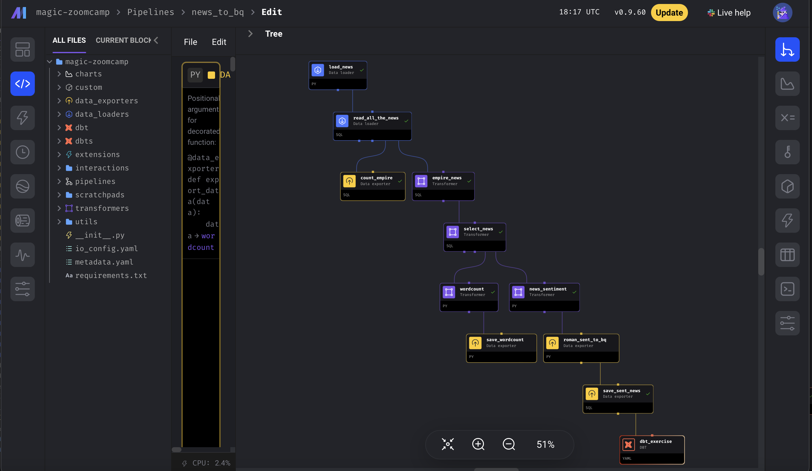

# Roman Empire Zoomcamp
Project for DTC Data Engineering Zoomcamp 2024


The goal of this project is to apply everything we have learned in [the course](https://github.com/DataTalksClub/data-engineering-zoomcamp/tree/main) to build an end-to-end data pipeline. OK. SPQR.

#### cr1 
[Back to Criteria](#cr)

## Problem description

How often do you think about the Roman Empire?

All my schoolmates and I think about the Roman Empire daily, just because we've finished the classical school with all these latin and ancient greek languages and many hours of history and literature, of course the ancient. And when this meme became popular (wiki says in mid-September 2023), I've understood, that we are not alone and all the world thinks about the Roman Empire too. Even when I did my homework on hadoop mapreduce course, the result of top 5 bigrams from wiki contained "roman_empire". That's nice!

In this project I want to think about the Roman Empire with authors and readers of newspapers since 1690 to 1963;).

I really want to know timeline of thinking about the Roman Empire and sentiment of messages, to see word cloud of article's content and average length of the artice.

## Project architecture

Data comes from [HuggingFace](https://huggingface.co/datasets/PleIAs/US-PD-Newspapers).

The whole process is orchestrated by the workflow orchestration engine [Mage](https://docs.mage.ai/introduction/overview). It also has dbt blocks!

A pipeline starts with scheduler and gets the data, saves it first as a parquet file (with buffer it looks ugly) and then moves to a Data Lake (GCP Storage). Then we transfer data from Data Lake to DWH (BigQuery) with some transformations, and then we do some transformations with dbt.

To create resources in GCP I used [Terraform](https://www.terraform.io/), just because it was in the course as IaC (Infrastructure as code) service and is really useful.

A dashboard was built with [Google Looker](https://cloud.google.com/looker) from BigQuery data.

This diagram presents the high level architecture of the project.


## Dashboard

This is what my final dashboard looks like:


You can view my dashboard till the end of Google Cloud trial period (16.04.2024) [here](https://lookerstudio.google.com/reporting/434973a5-24a5-4684-9f13-1ad60a7b4ec1).

## Reproducibility

You will find below **detailed instructions** for replicating this pipeline from scratch to the dashboard.

## Future work

- Try all this with another popular Cloud, that accept my cards:)
- Make incremental model, to append only the latest data from each load
- Documentation and data quality tests in dbt
- Try Spark transformations instead of dbt
- Try Streaming process with Kafka and Spark

## License

MIT License.

#### cr7 
[Back to Criteria](#cr)
## Instructions for reproducibility

You will find below **very detailed instructions** for replicating this pipeline from scratch to the dashboard.

The step-by-step instructions consist of several steps:

- Set Up Your Cloud Environment
  - Step 1: Create a project in Google Cloud Platform (GCP)
  - Step 2: Install Google Cloud CLI
  - Step 3: Configure permissions for GCP services
  - Step 4: Install Terraform
  - Step 5: Create resources in GCP using Terraform
- Set Up Your Virtual Machine
  - Step 6: Create SSH key pairs (optional)
  - Step 7: Create SSH config file (optional)
  - Step 8: Install packages on the Virtual Machine (Docker & Mage)
- Set Up and run pipeline
  - Step 9: Edit configuration file
  - Step 10: Build pipeline with Mage
  - Step 11: dbt development
- Step 12: Create dashboard for data visualization
- Step 13: Stop and delete to avoid costs


The project was developed using a Macbook, but locally there is only Terraform and Google CLI:) Of course we can create VM Instance with Terraform and Google CLI to create our project instance from there and have all the project in the Cloud, but it's seems to be a very stupid idea:) 

### Content of the repository

This repository (<https://github.com/nyan222/roman_empire_zoomcamp>) contains following folders:

- `terraform`: this folder is related to Terraform
- `mage-empire`: this folder contains Mage project with dbt project inside Mage
- `pics`: this folder contains pictures for this README

### Step 1: Create a new project in Google Cloud Platform
<details>
<summary>Expand</summary>

If you do not have a GCP account, [create one now](https://console.cloud.google.com/freetrial/). This tutorial can be
completed using only the services included in the GCP [free tier](https://cloud.google.com/free/).

Unfortunnaly, your credit card information is needed. And you should register google billing account only from the country, where you get your card, without vpn, and your card should not be virtual. Google has so nice working antifraud algorithm. So simple for some countries:((
GCP states that it will not charge you unless you explicitly end your free-trial period, but be careful. But it was clearly indicated when registering: No autocharge after free trial ends. But you should always be careful:)

Once you’ve created the account, log into [Google Cloud Platform (GCP) console](https://console.cloud.google.com).

[Create a new project](https://console.cloud.google.com/projectcreate) in the GCP console. Name this new project `roman-empire`. Make note of the **project ID** (mine is `coral-firefly-411510`). For subsequent steps, you will need to replace the `PROJECT_ID` with your own **project ID**.

Go to [Compute Engine API](https://console.cloud.google.com/apis/library/compute.googleapis.com), select your project (mine is `roman-empire`) and click on **ENABLE** button.


This operation may take some minutes.
</details>

### Step 2: Install Google Cloud CLI
<details>
<summary>Expand</summary>

The [Google Cloud CLI](https://cloud.google.com/sdk/gcloud) (gcloud CLI) is a set of tools to create and manage Google Cloud resources. You can use these tools to perform many common platform tasks from the command line or through scripts and other automation.

Go to [Install the gcloud CLI](https://cloud.google.com/sdk/docs/install), choose your Operating System (OS), and follow the installation instructions to install gcloud CLI on your local machine.

Confirm that gcloud is installed with `gcloud -v`.

``` txt
gcloud -v
```

You should see something like this:

``` txt
Google Cloud SDK 462.0.1
bq 2.0.101
core 2024.01.31
gcloud-crc32c 1.0.0
gsutil 5.27
```

If there is a problem, add path to your shell manually, my shell is here - ~/.zshrc, with some editor, I'm ok with vim, but you can better edit it with vscode.

```bash
# The next line updates PATH for the Google Cloud SDK.
if [ -f '~/Applications/google-cloud-sdk/path.zsh.inc' ]; then . '~/Applications/google-cloud-sdk/path.zsh.inc'; fi

# The next line enables shell command completion for gcloud.
if [ -f '~/Applications/google-cloud-sdk/completion.zsh.inc' ]; then . '~Applications/google-cloud-sdk/completion.zsh.inc'; fi
```

And then run:
```bash
source ~/.zshrc
```
</details>

### Step 3: Configure permissions for GCP services (with service account and it's key)
<details>
<summary>Expand</summary>

There is nice step-by-step instruction from Google, [how to create service account with console or CLI](https://cloud.google.com/iam/docs/service-accounts-create#iam-service-accounts-create-console).

See also an article [Understanding Service accounts](https://cloud.google.com/iam/docs/understanding-service-accounts).

The course shows, that we have to have these roles:


In console you schould add it by hands, following the instruction, but if you are ok with roles' names, you can use CLI.

From your local machine, run the following command.

``` bash
gcloud auth login
```

**Google Cloud SDK** will ask you for permission to access your Google Account. Click on **Allow** button.

Still from your local machine, run the following commands. Remember that you need to replace the `PROJECT_ID` with your own (mine is `coral-firefly-411510`).

``` bash
PROJECT_ID="coral-firefly-411510"
gcloud config set project $PROJECT_ID
gcloud components update
gcloud iam service-accounts create terraform-runner --display-name "terraform-runner"
```

In the Google Cloud console, on the left menu, go to the **IAM & Admin** and select **Service Accounts**. A service account whose name begins with `terraform-runner@…​` should be created (mine is `terraform-runner@coral-firefly-411510.iam.gserviceaccount.com`).

Next, we have to define the roles.

From your local machine, run the following commands.

Remember that you need to replace the `PROJECT_ID` with your own (mine is `coral-firefly-411510`).

``` bash
PROJECT_ID="coral-firefly-411510"
gcloud projects add-iam-policy-binding $PROJECT_ID \
--member="serviceAccount:terraform-iam@$PROJECT_ID.iam.gserviceaccount.com" \
--role="roles/viewer"
gcloud projects add-iam-policy-binding $PROJECT_ID \
--member="serviceAccount:terraform-iam@$PROJECT_ID.iam.gserviceaccount.com" \
--role="roles/storage.admin"
gcloud projects add-iam-policy-binding $PROJECT_ID \
--member="serviceAccount:terraform-iam@$PROJECT_ID.iam.gserviceaccount.com" \
--role="roles/storage.objectAdmin"
gcloud projects add-iam-policy-binding $PROJECT_ID \
--member="serviceAccount:terraform-iam@$PROJECT_ID.iam.gserviceaccount.com" \
--role="roles/bigquery.admin"
```

And so on, if you find all 13 roles. I did with console:)

Now, we have to download a JSON key file representing the credentials.

From your local machine, run the following commands.

Remember that you need to replace the `PROJECT_ID` with your own (mine is `coral-firefly-411510`).

``` bash
PROJECT_ID="coral-firefly-411510"
mkdir ~/.config/gcloud
gcloud iam service-accounts keys create ~/.config/gcloud/cfk.json \
--iam-account=terraform-runner@$PROJECT_ID.iam.gserviceaccount.com
```
(cfk means coral-firefly-key:)

You also can get the key from [console](https://cloud.google.com/iam/docs/keys-create-delete).

Please be careful with git!!! Use *.json in every .gitignore you have, the key shoud not get to repository. Everyone who get it can use your cloud resources.

Once the key has been downloaded, set your environment variable `GOOGLE_APPLICATION_CREDENTIALS` to the path of your JSON.

``` bash
export GOOGLE_APPLICATION_CREDENTIALS=~/.config/gcloud/cfk.json
```
From your local machine, run the following command to login again and answer 'Y' to continue.

``` bash
gcloud auth application-default login
```

**Google Auth Library** will ask you for permission to access your Google Account. Click on **Allow** button.

Congratulations! You are now authenticated with the gcloud CLI!
</details>

### Step 4: Install Terraform
<details>
<summary>Expand</summary>

[Terraform](https://developer.hashicorp.com/terraform/intro) is an infrastructure as code tool that lets you build,
change, and version cloud and on-prem resources safely and efficiently.

Go to [Install Terraform](https://developer.hashicorp.com/terraform/downloads?product_intent=terraform), choose version for your Operating System (OS), and follow the installation instructions to install Terraform on your local machine.

If you had difficulties with creating billing account for GCP, you could have problems with terraform site and then with terraform init, please use vpn.

Confirm that Terraform is installed with `terraform -version`:

``` txt
terraform -version
```

You should see something like this:

``` txt
Terraform v1.7.0
on darwin_arm64
```
</details>

#### cr2
[Back to Criteria](#cr)

### Step 5: Create resources in GCP using Terraform
<details>
<summary>Expand</summary>

We will now create the resources in our google cloud project. Instead of creating these resources manually, it is easier to create them programmatically.

With Terraform installed, you are ready to create infrastructure.

Clone this repository somewhere to your local machine:

``` bash
git clone https://github.com/nyan222/roman_empire_zoomcamp.git
```
In the week 1 of the Zoomcamp we did the same, but the problem is that we have to [create multiple BQ datasets](https://stackoverflow.com/questions/74586936/how-to-create-a-multiple-datasets-and-set-acess-in-bigquery) for dbt dev and prod and with 'raw' data.

This repository contains four files related to Terraform:

- `roman_empire_zoomcamp/terraform/main.tf` contains the main set of configuration for our project
- `roman_empire_zoomcamp/terraform/variables.tf` contain the variable definitions for our project
- `roman_empire_zoomcamp/terraform/resource/datasets.json` contains the json with datasets' descriptions
- `roman_empire_zoomcamp/terraform/locals.tf` contains the json parser

And we could not see resource/datasets.json because of security in .gitignore, here it is, we should create it again:
```json
{
    "datasets": {
      "roman_raw": {
        "dataset_id": "roman_raw"
      },
      "roman_dbt_dev": {
        "dataset_id": "roman_dbt_dev"
      },
      "roman_dbt_prod": {
        "dataset_id": "roman_dbt_prod"
      }
    }
  }
```

In `roman_empire_zoomcamp/terraform/variables.tf` file, you must replace the values of certain parameters with your own:

- Variable `project` for your `PROJECT_ID` (mine is `coral-firefly-411510`).
- Variable `region` for a region near you (mine is `us-west1`). Choose your location
  [here](https://cloud.google.com/about/locations), ideally offering low carbon intensity,
- Variable `zone`, used for the virtual machine (mine is `us-west1-b`). See [Available regions and
  zones](https://cloud.google.com/compute/docs/regions-zones#available).

Save and close the `roman_empire_zoomcamp/terraform/variables.tf` file.

When you create a new configuration with Terraform, you need to initialize the directory.

From your local machine, run [terraform init](https://www.terraform.io/docs/commands/init.html) to initialize the working directory:

``` bash
cd
cd roman_empire_zoomcamp/terraform/
terraform init
```

You should see this:

``` bash
Initializing the backend...

Successfully configured the backend "local"! Terraform will automatically
use this backend unless the backend configuration changes.

Initializing provider plugins...
- Finding latest version of hashicorp/google...
- Installing hashicorp/google v5.16.0...
- Installed hashicorp/google v5.16.0 (signed by HashiCorp)

Terraform has created a lock file .terraform.lock.hcl to record the provider
selections it made above. Include this file in your version control repository
so that Terraform can guarantee to make the same selections by default when
you run "terraform init" in the future.

Terraform has been successfully initialized!

You may now begin working with Terraform. Try running "terraform plan" to see
any changes that are required for your infrastructure. All Terraform commands
should now work.

If you ever set or change modules or backend configuration for Terraform,
rerun this command to reinitialize your working directory. If you forget, other
commands will detect it and remind you to do so if necessary.
```

Remember about vpn if you face difficulties.

Next, run [terraform validate](https://www.terraform.io/docs/commands/validate.html) to validate Terraform configuration files on the local machine:

``` bash
terraform validate
```

You should see this:

```bash
Success! The configuration is valid.
```

Next, run [terraform plan](https://developer.hashicorp.com/terraform/cli/commands/plan) to validate that Terraform configuration files from a remote services perspective:

``` bash
terraform plan
```

Terraform will indicate what infrastructure changes it plans to make.

You should see this:

```bash
Terraform used the selected providers to generate the following execution plan. Resource actions are indicated with the following
symbols:
  + create

Terraform will perform the following actions:

  # google_bigquery_dataset.datasets["roman_dbt_dev"] will be created
  + resource "google_bigquery_dataset" "datasets" {
      + creation_time              = (known after apply)
      + dataset_id                 = "roman_dbt_dev"
      + default_collation          = (known after apply)
      + delete_contents_on_destroy = true
      + effective_labels           = (known after apply)
      + etag                       = (known after apply)
      + id                         = (known after apply)
      + is_case_insensitive        = (known after apply)
      + last_modified_time         = (known after apply)
      + location                   = "us-west1"
      + max_time_travel_hours      = (known after apply)
      + project                    = "coral-firefly-411510"
      + self_link                  = (known after apply)
      + storage_billing_model      = (known after apply)
      + terraform_labels           = (known after apply)
    }

  # google_bigquery_dataset.datasets["roman_dbt_prod"] will be created
  + resource "google_bigquery_dataset" "datasets" {
      + creation_time              = (known after apply)
      + dataset_id                 = "roman_dbt_prod"
      + default_collation          = (known after apply)
      + delete_contents_on_destroy = true
      + effective_labels           = (known after apply)
      + etag                       = (known after apply)
      + id                         = (known after apply)
      + is_case_insensitive        = (known after apply)
      + last_modified_time         = (known after apply)
      + location                   = "us-west1"
      + max_time_travel_hours      = (known after apply)
      + project                    = "coral-firefly-411510"
      + self_link                  = (known after apply)
      + storage_billing_model      = (known after apply)
      + terraform_labels           = (known after apply)
    }

  # google_bigquery_dataset.datasets["roman_raw"] will be created
  + resource "google_bigquery_dataset" "datasets" {
      + creation_time              = (known after apply)
      + dataset_id                 = "roman_raw"
      + default_collation          = (known after apply)
      + delete_contents_on_destroy = true
      + effective_labels           = (known after apply)
      + etag                       = (known after apply)
      + id                         = (known after apply)
      + is_case_insensitive        = (known after apply)
      + last_modified_time         = (known after apply)
      + location                   = "us-west1"
      + max_time_travel_hours      = (known after apply)
      + project                    = "coral-firefly-411510"
      + self_link                  = (known after apply)
      + storage_billing_model      = (known after apply)
      + terraform_labels           = (known after apply)
    }

  # google_compute_instance.my-instance will be created
  + resource "google_compute_instance" "my-instance" {
      + allow_stopping_for_update = true
      + can_ip_forward            = false
      + cpu_platform              = (known after apply)
      + current_status            = (known after apply)
      + deletion_protection       = false
      + effective_labels          = (known after apply)
      + guest_accelerator         = (known after apply)
      + id                        = (known after apply)
      + instance_id               = (known after apply)
      + label_fingerprint         = (known after apply)
      + machine_type              = "e2-standard-4"
      + metadata_fingerprint      = (known after apply)
      + min_cpu_platform          = (known after apply)
      + name                      = "roman-empire"
      + project                   = "coral-firefly-411510"
      + self_link                 = (known after apply)
      + tags_fingerprint          = (known after apply)
      + terraform_labels          = (known after apply)
      + zone                      = "us-west1-b"

      + boot_disk {
          + auto_delete                = true
          + device_name                = (known after apply)
          + disk_encryption_key_sha256 = (known after apply)
          + kms_key_self_link          = (known after apply)
          + mode                       = "READ_WRITE"
          + source                     = (known after apply)

          + initialize_params {
              + image                  = "ubuntu-os-cloud/ubuntu-2004-lts"
              + labels                 = (known after apply)
              + provisioned_iops       = (known after apply)
              + provisioned_throughput = (known after apply)
              + size                   = 100
              + type                   = (known after apply)
            }
        }

      + network_interface {
          + internal_ipv6_prefix_length = (known after apply)
          + ipv6_access_type            = (known after apply)
          + ipv6_address                = (known after apply)
          + name                        = (known after apply)
          + network                     = "default"
          + network_ip                  = (known after apply)
          + stack_type                  = (known after apply)
          + subnetwork                  = "default"
          + subnetwork_project          = (known after apply)

          + access_config {
              + nat_ip       = (known after apply)
              + network_tier = (known after apply)
            }
        }
    }

  # google_storage_bucket.data-lake-bucket will be created
  + resource "google_storage_bucket" "data-lake-bucket" {
      + effective_labels            = (known after apply)
      + force_destroy               = true
      + id                          = (known after apply)
      + location                    = "US-WEST1"
      + name                        = "roman_empire_zoomcamp"
      + project                     = (known after apply)
      + public_access_prevention    = (known after apply)
      + rpo                         = (known after apply)
      + self_link                   = (known after apply)
      + storage_class               = "STANDARD"
      + terraform_labels            = (known after apply)
      + uniform_bucket_level_access = true
      + url                         = (known after apply)

      + lifecycle_rule {
          + action {
              + type = "Delete"
            }
          + condition {
              + age                   = 22
              + matches_prefix        = []
              + matches_storage_class = []
              + matches_suffix        = []
              + with_state            = (known after apply)
            }
        }

      + versioning {
          + enabled = true
        }
    }

Plan: 5 to add, 0 to change, 0 to destroy.
```

Nice! We see 3 BQ datasets:)

Finally, run [terraform apply](https://developer.hashicorp.com/terraform/cli/commands/apply) to execute the actions proposed in a Terraform plan and apply the configuration concretely on your project in Google Cloud.

``` bash
terraform apply
```

Respond to the confirmation prompt with a `yes`.

The last two commands may take some times to run.

After that, you should see somethig like this in your terminal:

``` bash
google_bigquery_dataset.datasets["roman_dbt_dev"]: Creating...
google_bigquery_dataset.datasets["roman_raw"]: Creating...
google_bigquery_dataset.datasets["roman_dbt_prod"]: Creating...
google_storage_bucket.data-lake-bucket: Creating...
google_compute_instance.my-instance: Creating...
google_bigquery_dataset.datasets["roman_dbt_prod"]: Creation complete after 2s [id=projects/coral-firefly-411510/datasets/roman_dbt_prod]
google_bigquery_dataset.datasets["roman_raw"]: Creation complete after 2s [id=projects/coral-firefly-411510/datasets/roman_raw]
google_bigquery_dataset.datasets["roman_dbt_dev"]: Creation complete after 2s [id=projects/coral-firefly-411510/datasets/roman_dbt_dev]
google_storage_bucket.data-lake-bucket: Creation complete after 3s [id=roman_empire_zoomcamp]
google_compute_instance.my-instance: Still creating... [10s elapsed]
google_compute_instance.my-instance: Creation complete after 18s [id=projects/coral-firefly-411510/zones/us-west1-b/instances/roman-empire]

Apply complete! Resources: 5 added, 0 changed, 0 destroyed.
```

In the Google Cloud console, on the left menu, go to the **Compute Engine** and **VM instances**. You shold see a new Virtual Machine (VM) instance (mine is `roman-empire`) on Ubuntu 20.04.6 LTS with 4vCPUs, 16 GB of memory and 100 GB of disk space.


Take note of your `EXTERNAL_IP`. We will need it later.

In the Google Cloud console, on the left menu, go to the **Cloud Storage** and **Buckets**. You shold see a new a new Compute Engine Bucket (mine is `roman_empire_zoomcamp`).


In the Google Cloud console, on the left menu, go to the **Big Query**. You shold see a new a new BigQuery Datasets (mine is `roman_raw`).


If these three services are created, everything is fine and we can move on to the next step.
</details>

### Step 6: Create SSH key pairs (optional)
<details>
<summary>Expand</summary>

Note!: In any case it would be nice to see again the lecture [DE Zoomcamp 1.4.1 - Setting up the Environment on Google Cloud (Cloud VM + SSH access)](https://www.youtube.com/watch?v=ae-CV2KfoN0).

In order to avoid typing the password each time to connect to the VM from the local machine, you can create an SSH key pairs on the local machine.

Follow the instructions below according to your Operating System (OS).

#### Linux and macOS

For Linux and macOS, run the following command. Replace the `USERNAME` on your computer. Replace also `KEY_FILENAME` with a more common filename like `my-ssh-key`.

``` bash
ssh-keygen -t rsa -f ~/.ssh/KEY_FILENAME -C USERNAME -b 2048
```

`ssh-keygen` saves your private key file to `~/.ssh/KEY_FILENAME` and your public key file to `~/.ssh/KEY_FILENAME.pub`.

#### Windows 10 or later

For Windows 10 or later, see these [instructions](https://cloud.google.com/compute/docs/connect/create-ssh-keys#windows-10-or-later).

`ssh-keygen` saves your private key file to `C:\Users\WINDOWS_USER\.ssh\KEY_FILENAME` and your public key file to `C:\Users\WINDOWS_USER\.ssh\KEY_FILENAME.pub`.

#### Add SSH keys to VM

Next, copy and upload the public key `KEY_FILENAME.pub` to GCP.

In the Google Cloud console, select **Compute Engine** from the left menu, then **Metadata** (list down-down-down), select **SSH KEYS** tab,
click on **ADD SSH KEY** button.

Paste the public key in the field, and click on **SAVE** button.


Here, a trick to copy the contents of your public `KEY_FILENAME.pub` file. Just run the following command.

``` bash
cat ~/.ssh/KEY_FILENAME.pub | pbcopy
```
</details>

### Step 7: Create SSH config file (optional)
<details>
<summary>Expand</summary>

Next, create a file `~/.ssh/config` on your local machine:

``` bash
touch ~/.ssh/config
```

Edit the file et add this content:

``` bash
Host roman-empire
    HostName EXTERNAL_IP
    User USERNAME
    IdentityFile ~/.ssh/KEY_FILENAME
```

Replace the following:

- `EXTERNAL_IP`: the external IP of the VM instance. It always changes, when you stop and start your VM, so you should every time edit config, but it's ok and don't forget
- `USERNAME`: your username on the VM, either the same username used to generate the SSH key.
- `~/.ssh/KEY_FILENAME`: the path of the private SSH key. Note that it has to be absolute path for Windows.

To access your virtual machine, just run this command:

``` bash
ssh roman-empire
```

Respond to the confirmation prompt with a `yes`.

Nicevi! You should see this something like this:

``` txt
The authenticity of host 'XXX.XXX.XXX.XXX (XXX.XXX.XXX.XXX)' can't be established.
ED25519 key fingerprint is SHA256:Cb5xffksisnldfglkw98sdidf9d8sg09ad8g+FB71c.
This key is not known by any other names
Are you sure you want to continue connecting (yes/no/[fingerprint])? yes
Warning: Permanently added 'XXX.XXX.XXX.XXX' (EDXXXXX) to the list of known hosts.
Welcome to Ubuntu 20.04.6 LTS (GNU/Linux 5.15.0-1051-gcp x86_64)

 * Documentation:  https://help.ubuntu.com
 * Management:     https://landscape.canonical.com
 * Support:        https://ubuntu.com/pro

  System information as of Sat Feb 17 11:40:32 UTC 2024

  System load:  0.0               Processes:             118
  Usage of /:   2.0% of 96.73GB   Users logged in:       0
  Memory usage: 1%                IPv4 address for ens4: 10.138.0.3
  Swap usage:   0%

Expanded Security Maintenance for Applications is not enabled.

0 updates can be applied immediately.

Enable ESM Apps to receive additional future security updates.
See https://ubuntu.com/esm or run: sudo pro status


The list of available updates is more than a week old.
To check for new updates run: sudo apt update


The programs included with the Ubuntu system are free software;
the exact distribution terms for each program are described in the
individual files in /usr/share/doc/*/copyright.

Ubuntu comes with ABSOLUTELY NO WARRANTY, to the extent permitted by
applicable law.

g***k@roman-empire:~$
```

Otherwise, without `~/.ssh/config` file, you need to run this command:

``` bash
ssh -i ~/.ssh/gcp USERNAME@EXTERNAL_IP
```

Where `USERNAME` is your username on the VM and `EXTERNAL_IP` is the external IP of the VM.
</details>

### Step 8: Install packages on the Virtual Machine
<details>
<summary>Expand</summary>

First of all we have to install Docker!

Remember that you can run the `ssh roman-empire` command from your local machine to easily access your remote instance.

``` bash
sudo apt-get update
sudo apt-get install docker.io
sudo groupadd docker
sudo gpasswd -a $USER docker
sudo service docker restart
logout
```
And then again `ssh roman-empire`.

And we need also docker compose, we can choose best version [here](https://github.com/docker/compose).

```bash
mkdir bin
cd bin
wget https://github.com/docker/compose/releases/download/v2.15.0/docker-compose-linux-x86_64 -O docker-compose
ls -la
# docker-compose
chmod +x docker-compose
./docker-compose version
# Docker Compose version v2.15.0
cd
vim .bashrc
```

Then we should add this in .bashrc file (I for Insert, Escape to return, :wq - save and exit):
```bash
export PATH="${HOME}/bin:${PATH}"
```

And then we return to cli:
```bash
source .bashrc
which docker-compose
# /home/g***k/bin/docker-compose
docker-compose version
# Docker Compose version v2.15.0
```

So now we need our workflow orchestrator Mage.

Everything for quick start can be found here - so nice and short and clear [videos](https://github.com/DataTalksClub/data-engineering-zoomcamp/tree/main/02-workflow-orchestration).


We should clone [the repository of Roman Empire Project](https://github.com/nyan222/roman_empire_zoomcamp.git) to VM:
```bash
cd
git clone https://github.com/nyan222/roman_empire_zoomcamp.git
chmod 777 roman_empire_zoomcamp
cd roman_empire_zoomcamp/mage-empire/
mv dev.env .env
docker-compose up -d --build
docker ps
```
And finally we see this:
```bash
CONTAINER ID   IMAGE                  COMMAND                  CREATED              STATUS          PORTS                                                 NAMES
13aad82abe5b   mageai/mageai:latest   "mage start magic-ro…"   About a minute ago   Up 56 seconds   0.0.0.0:6789->6789/tcp, :::6789->6789/tcp, 7789/tcp   mage-empire-magic-1
7e13e665feeb   postgres:14            "docker-entrypoint.s…"   About a minute ago   Up 56 seconds   0.0.0.0:5432->5432/tcp, :::5432->5432/tcp             magic-roman-postgres
```

And now we need to put Google service account key to our mage project.

Do it from your local machine.
Note!!!: yuo shoud begin from directory, where the key lies and act quickly!
```bash
sftp roman-empire
cd roman_empire_zoomcamp/mage-empire
put cfk.json
```

For some debugging things we can  install Anaconda for Linux, but it's optional.

Best for you version to install your can find [here](https://www.anaconda.com/download#downloads).

``` bash
cd
wget https://repo.anaconda.com/archive/Anaconda3-2023.09-0-MacOSX-arm64.sh
bash Anaconda3-2023.09-0-MacOSX-arm64.sh
rm Anaconda3-2023.09-0-MacOSX-arm64.sh
source ~/anaconda3/bin/activate
source ~/.bashrc
```

Still on your VM instance, run the following commands to create a conda environment and install necessary packages:

``` bash
cd
git clone https://github.com/nyan222/roman_empire_zoomcamp.git
conda create -n myenv python=3.9
conda activate myenv
conda install pip
conda update -n base -c defaults conda
pip install -r ~/roman_empire_zoomcamp/requirements.txt
pip install -U pip setuptools wheel
```

After that, you have a conda environment `myenv` with all required libraries installed.
</details>

### Step 9: Edit configuration file
<details>
<summary>Expand</summary>

Next, you’ll need to create a configuration file with your details for the orchestration workflow.

We have a configuration file for Mage here: `~/roman_empire_zoomcamp/mage-empire/magic-roman/io_config.yaml`.

The most important thing in this project is that we have to check the path to the credential key in file and in Mage terminal, and everything must be ok.

If not, check, where credential json is. It's strange, but sometimes it puts (when we use sftp) in home directory...

```txt
dev:
  # PostgresSQL
  POSTGRES_CONNECT_TIMEOUT: 10
  POSTGRES_DBNAME: "{{ env_var('POSTGRES_DBNAME') }}"
  POSTGRES_SCHEMA: "{{ env_var('POSTGRES_SCHEMA') }}" # Optional
  POSTGRES_USER: "{{ env_var('POSTGRES_USER') }}"
  POSTGRES_PASSWORD: "{{ env_var('POSTGRES_PASSWORD') }}"
  POSTGRES_HOST: "{{ env_var('POSTGRES_HOST') }}"
  POSTGRES_PORT: "{{ env_var('POSTGRES_PORT') }}"
  #POSTGRES_CONNECTION_METHOD: direct
  # Google
  GOOGLE_SERVICE_ACC_KEY_FILEPATH: "/home/src/cfk.json"
  GOOGLE_LOCATION: us-west1 # Optional
```

Note the name of the environment (dev) !!!

To get Mage interface on local machine we shoul throw port from VSCode (this works, another methods not ok in my f**king network).

In VS Code, go to the **Command Palette** (`Shift+Cmd+P`), select **Remote-SSH: Connect to Host…​**, and select your VM `roman-empire`.

You will get your own VS Code window, connected to you server, and will be able to throw port (manually):


So we can open our [Mage UI](http://localhost:6789), then Terminal and test the location of the key:
```bash
pwd
ls -la
```


I hope everything is ok, let's go and build pipeline!
</details>

#### cr3 
[Back to Criteria](#cr)

### Step 10: Build pipeline with Mage
<details>
<summary>Expand</summary>

UI is very simple, but it's better to watch this [very short video](https://www.youtube.com/watch?v=stI-gg4QBnI&list=PL3MmuxUbc_hJed7dXYoJw8DoCuVHhGEQb&index=20) about example_pipeline (3 min)  and the beginning of [this video](https://www.youtube.com/watch?v=w0XmcASRUnc&list=PL3MmuxUbc_hJed7dXYoJw8DoCuVHhGEQb&index=24) for understanding, how to build pipeline from scratch (first 3 min).

In reality you should press the button New pipeline, then Edit to change the name, and then choose a module.
But we have already two pipelines - `example_pipeline` from Mage and our `news_to_bq`.

So lets go to pipelines (left menu) --> `news_to_bq`:


And let's see all the blocks of the pipeline:



First we have to load our data.
Of course I wanted to get modern data from twitter-x or insta, but snscraper does not work anymore, so we have nice dataset from [HuggingFace](https://huggingface.co/datasets/PleIAs/US-PD-Newspapers).

```text
Content
As of January 2024, the collection contains nearly 21 millions unique newspaper and periodical editions published from the 1690 to 1963 (98,742,987,471 words).

The collection was compiled by Pierre-Carl Langlais based on the dumps made available by the Library of Congress. Each parquet file matches one of the 2618 original dump files, including their code name. It has the full text of a few thousand selected at random and a few core metadatas (edition id, date, word counts…). The metadata can be easily expanded thanks to the LOC APIs and other data services.

The American Stories dataset is a curated and enhanced version of the same resource, with significant progress in regards to text quality and documentation. It currently retains about 20% of the original material.
```

In reality we have 2657 files! That's nice, that dataset grows, and we have to think about it in loader - to load only new files sometimes.

So we have:

#### Python block `DATA LOADER` with the name `load news` and code below:
```python
from google.cloud import storage
import requests
import os
import re
import datetime
import pandas as pd
import pyarrow.parquet as pq
import pyarrow as pa
import io

if 'data_loader' not in globals():
    from mage_ai.data_preparation.decorators import data_loader
if 'test' not in globals():
    from mage_ai.data_preparation.decorators import test

os.environ['GOOGLE_APPLICATION_CREDENTIALS'] = "/home/src/cfk.json"

def get_max_blob_name(bucket_name):
    storage_client = storage.Client()
    blobs = storage_client.list_blobs(bucket_name)
    
    max_blob_name = max((blob.name for blob in blobs), default=None)
    return max_blob_name

def upload_to_gcs(bucket, object_name, local_file):
    """
    Ref: https://cloud.google.com/storage/docs/uploading-objects#storage-upload-object-python
    """
    # # WORKAROUND to prevent timeout for files > 6 MB on 800 kbps upload speed.
    # # (Ref: https://github.com/googleapis/python-storage/issues/74)
    # storage.blob._MAX_MULTIPART_SIZE = 5 * 1024 * 1024  # 5 MB
    # storage.blob._DEFAULT_CHUNKSIZE = 5 * 1024 * 1024  # 5 MB

    client = storage.Client()
    bucket = client.bucket(bucket)
    blob = bucket.blob(object_name)
    blob.upload_from_filename(local_file)


bucket_name = 'roman_empire_zoomcamp'
BUCKET = os.environ.get("GCP_GCS_BUCKET", "roman_empire_zoomcamp")
init_url = 'https://huggingface.co/datasets/PleIAs/US-PD-Newspapers/resolve/refs%2Fconvert%2Fparquet/default/train'

@data_loader
def load_data(*args, **kwargs):
    ## we have to find max file in gcs storage directory
    fn = get_max_blob_name(bucket_name)   
    print(fn)
    ## and then extract the number
    if fn is not None:
        n = re.search(r'\d+', fn).group()
        print(n) 
        n = int(n)
        m = n + 1
    else:
        n = -1
        m = 0
    t = True
    while t:
        num = '000'+str(m)
        num = num[-4:]
        file_name = f"{num}.parquet"
        request_url = f"{init_url}/{file_name}"
        print(str(datetime.datetime.now())+": "+request_url)
        r = requests.head(request_url, allow_redirects=True)
        print(r.status_code)
        ## we have to check files in huggingface
        if m == n+1 and r.status_code != 200: 
            print('nofile') 
            raise Exception("no new files")
        elif m > n+1 and r.status_code != 200:
            print('nomorefile')  
            break
        else:   
            m = m + 1
            df = pd.read_parquet(request_url,engine='pyarrow')

            df.to_parquet(file_name, engine='pyarrow',coerce_timestamps="ms",allow_truncated_timestamps=True)###
            print(f"Parquet: {file_name}")
    
            # upload to gcs 
            upload_to_gcs(BUCKET, f"{file_name}", file_name)
            print(f"GCS: {file_name}")


@test
def test_output(output, *args) -> None:
    """
    Template code for testing the output of the block.
    """
    assert output is not None, 'The output is undefined'
```


Nice! There are only two things - loader works for about a day and you should delete local *.parquet files from `~/roman_empire_zoomcamp/mage-empire/magic-roman/`. On the first start with 2657 files you have to do it manually, just not to delete that very parquet, that we load to gcs storage right now, and for other runs we have to put in crontab this line:
```bash
~/roman_empire_zoomcamp/mage-empire/*.parquet -type f -mtime +1 -exec rm {} +
```
To edit crontab ([Crontab Quick Start](https://help.ubuntu.com/community/CronHowto)) we should do this in the terminal of our VM:
```bash
crontab -e
```
And then edit like in vim ( I for insert, Esc for return, :wq for save and quit).

If you don't want problems with deleting parquets, you can use buffer, but then you'll get file_name.parquet as a directory and some ugly name inside. The code should look like this:
```python
parquet_buffer = io.BytesIO()
table = pa.Table.from_pandas(df)
pq.write_table(table, parquet_buffer)

# Upload the Parquet data to Google Cloud Storage with the desired file name
bucket_name = 'your-bucket-name'
file_name = 'file.parquet'  # Specify the desired file name
blob_name = f'destination/{file_name}'

storage_client = storage.Client()
bucket = storage_client.get_bucket(bucket_name)
blob = bucket.blob(blob_name)
parquet_buffer.seek(0)  # Reset the buffer position before uploading
blob.upload_from_file(parquet_buffer, content_type='application/octet-stream')
```

We have our data in Data Lake (GCS Bucket) and have to move them to DWH (BigQuery).

Remember, that you have change `coral-firefly-411510` to your `PROJECT-ID`!!!

#### Sql block `DATA LOADER`, name `read_all_the_news`
(Connection here and then - BigQuery - dev - Use raw SQL)
```sql
-- Docs: https://docs.mage.ai/guides/sql-blocks
CREATE OR REPLACE EXTERNAL TABLE `roman_raw.external_roman`
OPTIONS (
  format = PARQUET,
  uris = ['gs://roman_empire_zoomcamp/*.parquet']
);

CREATE OR REPLACE TABLE `roman_raw.all_news` as
select * from `roman_raw.external_roman`;
```


From here we have two branches:

#### 1. Sql block `DATA EXPORTER`, name `count_empire`
Here we count all the articles by yeaar and the articles, that mentioned Roman Empire
```sql
create or replace table `coral-firefly-411510.roman_raw.roman_count` as 
SELECT year, 
count(*) all_articles,
sum(case when lower(text) like '%roman empire%' then 1 else 0 end) roman_articles
FROM (select * , extract( year from cast(date as date)) year 
from `roman_raw.all_news`) 
group by year;
SELECT year, 
count(*) all_articles,
sum(case when lower(text) like '%roman empire%' then 1 else 0 end) roman_articles
FROM (select * , extract( year from cast(date as date)) year 
from `roman_raw.all_news`) 
group by year;
```


#### 2. Sql block `TRANSFORMER`, name `empire_news`
We select only Roman Empire news!:)
```sql
create or replace table `coral-firefly-411510.roman_raw.roman_news` as
select news.id
,cast(news.date as date) date
,news.edition
,news.page
,news.file_name
,news.word_count
,news.text 
,news.year 
from (select * , extract( year from cast(date as date)) year 
from `roman_raw.all_news`) news
where lower(text) like '%roman empire%';
```


And read this to use in python blocks.

#### Sql block `TRANSFORMER`, name `select_news`
```sql
select * from `coral-firefly-411510.roman_raw.roman_news`;
```

From here we again have two branches:

#### 2.1 Python block `TRANSFORMER`, name `wordcount`
I want to have wordcloud at my dashboard, so i need wordcount:
```python
import string
import re
import nltk
#nltk.download('word_tokenize')
nltk.download('stopwords')
from nltk.tokenize import word_tokenize
from nltk.probability import FreqDist
from nltk.corpus import stopwords
import pandas as pd

if 'transformer' not in globals():
    from mage_ai.data_preparation.decorators import transformer
if 'test' not in globals():
    from mage_ai.data_preparation.decorators import test


@transformer
def transform(data, *args, **kwargs):
    print(data.shape)
    df = data.groupby('year').agg({'text': ' '.join}).reset_index()

    # Convert text to lowercase
    df['text'] = df['text'].str.lower()

    # Remove special characters and digits
    spec_chars = string.punctuation + '\t'
    df['text'] = df['text'].apply(lambda x: ''.join([ch for ch in x if ch not in spec_chars]))
    df['text'] = df['text'].apply(lambda x: re.sub('\n', ' ', x))
    df['text'] = df['text'].apply(lambda x: ''.join([ch for ch in x if ch not in string.digits]))
    print(df.head(2))
    #tokenize and clean again
    df['text_tokens'] = df['text'].apply(lambda x: word_tokenize(x))
    eng_stopwords = stopwords.words("english")
    df['text_tokens'] = df['text_tokens'].apply(lambda x: [token.strip() for token in x if token not in eng_stopwords])
    df['text_tokens'] = df['text_tokens'].apply(lambda x: [token.strip() for token in x if len(token) > 2])
    #df['text_tokens'] = df['text_tokens'].apply(lambda x: nltk.Text(df['text_tokens']))
    print(df.head(2))
    # Calculate the frequency distribution
    df['fdist'] = df['text_tokens'].apply(lambda x: nltk.FreqDist(x).most_common(20))

    # Drop the unnecessary columns and display the first 2 rows
    df = df.drop(columns=['text', 'text_tokens'])
    print(df.head(2))

    # Create a new DataFrame for word count
    new_data = []
    for index, row in df.iterrows():
        year = row['year']
        for word, count in row['fdist']:
            new_data.append([year, word, count])

    new_df = pd.DataFrame(new_data, columns=['year', 'word', 'count'])
   
    return new_df


@test
def test_output(output, *args) -> None:
    """
    Template code for testing the output of the block.
    """
    assert output is not None, 'The output is undefined'
```

#### Python block `DATA EXPORTER`, name `save_wordcount`
```python
from mage_ai.settings.repo import get_repo_path
from mage_ai.io.bigquery import BigQuery
from mage_ai.io.config import ConfigFileLoader
from pandas import DataFrame
from os import path

if 'data_exporter' not in globals():
    from mage_ai.data_preparation.decorators import data_exporter


@data_exporter
def export_data_to_big_query(df: DataFrame, **kwargs) -> None:
    """
    Template for exporting data to a BigQuery warehouse.
    Specify your configuration settings in 'io_config.yaml'.

    Docs: https://docs.mage.ai/design/data-loading#bigquery
    """
    table_id = 'coral-firefly-411510.roman_raw.roman_wordcount'
    config_path = path.join(get_repo_path(), 'io_config.yaml')
    config_profile = 'dev'

    BigQuery.with_config(ConfigFileLoader(config_path, config_profile)).export(
        df,
        table_id,
        if_exists='replace',  # Specify resolution policy if table name already exists
    )
```


#### 2.2 Python block `TRANSFORMER`, name `roman_sentiment`
We want to know the sentiment of the article
```python
import nltk
from nltk.sentiment.vader import SentimentIntensityAnalyzer
nltk.download('vader_lexicon')
import pandas as pd

if 'transformer' not in globals():
    from mage_ai.data_preparation.decorators import transformer
if 'test' not in globals():
    from mage_ai.data_preparation.decorators import test


@transformer
def transform(data, *args, **kwargs):
    df = pd.DataFrame(data, columns=['id','date','edition','page','file_name','word_count', 'text','year'])
    news_list = []
    for index, news in df.iterrows():
        #print(news)
        analyzer = SentimentIntensityAnalyzer().polarity_scores(news.text)
        neg = analyzer['neg']
        neu = analyzer['neu']
        pos = analyzer['pos']


        if neg > pos:
            news['sent'] = 'neg'
        elif pos > neg:
            news['sent'] = 'pos'
        elif pos == neg:
            news['sent'] = 'neu'
        #print(news)
        news_list.append([news.id,news.date,news.edition,news.page,news.file_name,news.word_count, news.text,news.year, news.sent])
    data = pd.DataFrame(news_list, columns=['id','date','edition','page','file_name','word_count', 'text','year','sent'])
    return data


@test
def test_output(output, *args) -> None:
    """
    Template code for testing the output of the block.
    """
    assert output is not None, 'The output is undefined'
```

#### Python block `DATA EXPORTER`, name `roman_sent_to_bq`
```python
from mage_ai.settings.repo import get_repo_path
from mage_ai.io.bigquery import BigQuery
from mage_ai.io.config import ConfigFileLoader
from pandas import DataFrame
from os import path

if 'data_exporter' not in globals():
    from mage_ai.data_preparation.decorators import data_exporter


@data_exporter
def export_data_to_big_query(df: DataFrame, **kwargs) -> None:
    """
    Template for exporting data to a BigQuery warehouse.
    Specify your configuration settings in 'io_config.yaml'.

    Docs: https://docs.mage.ai/design/data-loading#bigquery
    """
    table_id = 'coral-firefly-411510.roman_raw.roman_sent1'
    config_path = path.join(get_repo_path(), 'io_config.yaml')
    config_profile = 'dev'

    BigQuery.with_config(ConfigFileLoader(config_path, config_profile)).export(
        df,
        table_id,
        if_exists='replace',  # Specify resolution policy if table name already exists
    )
```
#### cr4 
[Back to Criteria](#cr)

I've got problems to save python df to BQ with partitioning and clustering, but i need it
I need partitioning by year, it's obvious, and clustering by word_count, if i need 5 shortest articles to print for example, so I do it.

#### Python block `DATA EXPORTER`, name `roman_sent_to_bq`
```python
create or replace table `coral-firefly-411510.roman_raw.roman_sent` 
PARTITION BY DATE_TRUNC(date,YEAR)
CLUSTER BY word_count AS
select * from `roman_raw.roman_sent1`;
```


#### cr5
[Back to Criteria](#cr)

And now the last but not the least - dbt!
#### dbt block `DBT` with name `dbt_exercise`


And all the log:
```bash
INFO:dbt_exercise_test:dbt deps \

    --project-dir /home/src/**************/dbt/dbt_cloud \

    --vars {"env": "dev", "execution_date": "2024-02-23T19:21:09.721620", "interval_start_datetime": "2024-02-23T19:21:09.721620", "event": {}, "configuration": {"data_provider": "bigquery", "data_provider_profile": "dev", "dbt": {"command": "run"}, "dbt_profile_target": "prod", "dbt_project_name": "dbt/dbt_cloud", "disable_query_preprocessing": false, "export_write_policy": "append", "file_source": {"path": "dbts/dbt_exercise.yaml"}, "use_raw_sql": false}, "context": {}, "pipeline_uuid": "news_to_bq", "block_uuid": "dbt_exercise"} \

    --target prod \

    --profiles-dir /home/src/**************/.profiles_interpolated_temp_39e7cc77-2e44-4e70-a353-8e50927612d0

 19:21:09  Running with dbt=1.7.4

 INFO:dbt_exercise_test:Running with dbt=1.7.4

 19:21:09  Installing dbt-labs/dbt_utils

 INFO:dbt_exercise_test:Installing dbt-labs/dbt_utils

 19:21:10  Installed from version 1.1.1

INFO:dbt_exercise_test:Installed from version 1.1.1

 19:21:10  Up to date!

 INFO:dbt_exercise_test:Up to date!

 19:21:10  Installing dbt-labs/codegen

 INFO:dbt_exercise_test:Installing dbt-labs/codegen

 19:21:11  Installed from version 0.12.1

 INFO:dbt_exercise_test:Installed from version 0.12.1

 19:21:11  Up to date!

 INFO:dbt_exercise_test:Up to date!

 19:21:11  Installing calogica/dbt_date

 INFO:dbt_exercise_test:Installing calogica/dbt_date

 19:21:11  Installed from version 0.9.2

 INFO:dbt_exercise_test:Installed from version 0.9.2

19:21:11  Updated version available: 0.10.0

 INFO:dbt_exercise_test:Updated version available: 0.10.0

19:21:11  

 INFO:dbt_exercise_test:

 19:21:11  Updates available for packages: ['calogica/dbt_date']                 

Update your versions in packages.yml, then run dbt deps

 INFO:dbt_exercise_test:Updates available for packages: ['calogica/dbt_date']                 

Update your versions in packages.yml, then run dbt deps

 INFO:dbt_exercise_test:dbt run \

    --project-dir /home/src/**************/dbt/dbt_cloud \

    --vars {"env": "dev", "execution_date": "2024-02-23T19:21:09.721620", "interval_start_datetime": "2024-02-23T19:21:09.721620", "event": {}, "configuration": {"data_provider": "bigquery", "data_provider_profile": "dev", "dbt": {"command": "run"}, "dbt_profile_target": "prod", "dbt_project_name": "dbt/dbt_cloud", "disable_query_preprocessing": false, "export_write_policy": "append", "file_source": {"path": "dbts/dbt_exercise.yaml"}, "use_raw_sql": false}, "context": {}, "pipeline_uuid": "news_to_bq", "block_uuid": "dbt_exercise"} \

    --target prod \

    --profiles-dir /home/src/**************/.profiles_interpolated_temp_39e7cc77-2e44-4e70-a353-8e50927612d0

 19:21:12  Running with dbt=1.7.4

 INFO:dbt_exercise_test:Running with dbt=1.7.4

 19:21:12  Registered adapter: bigquery=1.7.2

 INFO:dbt_exercise_test:Registered adapter: bigquery=1.7.2

 19:21:12  Unable to do partial parsing because config vars, config profile, or config target have changed

 INFO:dbt_exercise_test:Unable to do partial parsing because config vars, config profile, or config target have changed

 19:21:13  Found 6 models, 2 tests, 3 sources, 0 exposures, 0 metrics, 704 macros, 0 groups, 0 semantic models

 INFO:dbt_exercise_test:Found 6 models, 2 tests, 3 sources, 0 exposures, 0 metrics, 704 macros, 0 groups, 0 semantic models

 19:21:13  

 INFO:dbt_exercise_test:

 19:21:14  Concurrency: 4 threads (target='prod')

 INFO:dbt_exercise_test:Concurrency: 4 threads (target='prod')

 19:21:14  

 INFO:dbt_exercise_test:

 19:21:14  1 of 6 START sql view model roman_dbt_prod.stg_roman_count ..................... [RUN]

 19:21:14  2 of 6 START sql view model roman_dbt_prod.stg_roman_sent ...................... [RUN]

 INFO:dbt_exercise_test:1 of 6 START sql view model roman_dbt_prod.stg_roman_count ..................... [RUN]

 INFO:dbt_exercise_test:2 of 6 START sql view model roman_dbt_prod.stg_roman_sent ...................... [RUN]

 19:21:15  2 of 6 OK created sql view model roman_dbt_prod.stg_roman_sent ................. [CREATE VIEW (0 processed) in 1.52s]

 INFO:dbt_exercise_test:2 of 6 OK created sql view model roman_dbt_prod.stg_roman_sent ................. [CREATE VIEW (0 processed) in 1.52s]

 19:21:15  3 of 6 START sql table model roman_dbt_prod.dm_yearly_avg_word_count ........... [RUN]

 19:21:15  4 of 6 START sql table model roman_dbt_prod.dm_yearly_sentiment_count .......... [RUN]

 19:21:15  5 of 6 START sql table model roman_dbt_prod.fact_roman_news .................... [RUN]

 INFO:dbt_exercise_test:3 of 6 START sql table model roman_dbt_prod.dm_yearly_avg_word_count ........... [RUN]

 INFO:dbt_exercise_test:4 of 6 START sql table model roman_dbt_prod.dm_yearly_sentiment_count .......... [RUN]

 INFO:dbt_exercise_test:5 of 6 START sql table model roman_dbt_prod.fact_roman_news .................... [RUN]

 19:21:15  1 of 6 OK created sql view model roman_dbt_prod.stg_roman_count ................ [CREATE VIEW (0 processed) in 1.56s]

 INFO:dbt_exercise_test:1 of 6 OK created sql view model roman_dbt_prod.stg_roman_count ................ [CREATE VIEW (0 processed) in 1.56s]

 19:21:15  6 of 6 START sql table model roman_dbt_prod.fact_roman_count ................... [RUN]

 INFO:dbt_exercise_test:6 of 6 START sql table model roman_dbt_prod.fact_roman_count ................... [RUN]

 19:21:19  6 of 6 OK created sql table model roman_dbt_prod.fact_roman_count .............. [CREATE TABLE (366.0 rows, 4.3 KiB processed) in 3.24s]

 INFO:dbt_exercise_test:6 of 6 OK created sql table model roman_dbt_prod.fact_roman_count .............. [CREATE TABLE (366.0 rows, 4.3 KiB processed) in 3.24s]

 19:21:19  4 of 6 OK created sql table model roman_dbt_prod.dm_yearly_sentiment_count ..... [CREATE TABLE (338.0 rows, 316.2 KiB processed) in 3.62s]

 INFO:dbt_exercise_test:4 of 6 OK created sql table model roman_dbt_prod.dm_yearly_sentiment_count ..... [CREATE TABLE (338.0 rows, 316.2 KiB processed) in 3.62s]

 19:21:19  3 of 6 OK created sql table model roman_dbt_prod.dm_yearly_avg_word_count ...... [CREATE TABLE (177.0 rows, 389.1 KiB processed) in 4.03s]

 INFO:dbt_exercise_test:3 of 6 OK created sql table model roman_dbt_prod.dm_yearly_avg_word_count ...... [CREATE TABLE (177.0 rows, 389.1 KiB processed) in 4.03s]

 19:21:54  5 of 6 OK created sql table model roman_dbt_prod.fact_roman_news ............... [CREATE TABLE (24.9k rows, 794.9 MiB processed) in 38.92s]

 INFO:dbt_exercise_test:5 of 6 OK created sql table model roman_dbt_prod.fact_roman_news ............... [CREATE TABLE (24.9k rows, 794.9 MiB processed) in 38.92s]

 19:21:54  

 INFO:dbt_exercise_test:

 19:21:54  Finished running 2 view models, 4 table models in 0 hours 0 minutes and 41.65 seconds (41.65s).

 INFO:dbt_exercise_test:Finished running 2 view models, 4 table models in 0 hours 0 minutes and 41.65 seconds (41.65s).

 19:21:54  

 INFO:dbt_exercise_test:

 19:21:54  Completed successfully

 INFO:dbt_exercise_test:Completed successfully

 19:21:54  

 INFO:dbt_exercise_test:

 19:21:54  Done. PASS=6 WARN=0 ERROR=0 SKIP=0 TOTAL=6

 INFO:dbt_exercise_test:Done. PASS=6 WARN=0 ERROR=0 SKIP=0 TOTAL=6
```


Nice!!!
The project is here: `~/roman_empire_zoomcamp/mage-empire/magic-roman/dbt/dbt_cloud` (and the same path is in github).

It works, because we have our `profiles.yml` in the directory above, as it was said in the [Mage instruction](https://docs.mage.ai/dbt/add-existing-dbt).

It looks like:
```yaml
bq_dbt:
  outputs:
    prod:
      dataset: roman_dbt_prod
      fixed_retries: 1
      keyfile: /home/src/cfk.json
      location: us-west1
      method: service-account
      priority: interactive
      project: coral-firefly-411510 
      threads: 4
      timeout_seconds: 300
      type: bigquery
  target: prod  
```
Note the target `prod`, we use it in the block, and name `bq_dbt` - we use it in `dbt_project.yml`:
```yaml

# Name your project! Project names should contain only lowercase characters
# and underscores. A good package name should reflect your organization's
# name or the intended use of these models
name: 'dbt_cloud'
version: '1.0.0'
config-version: 2

# This setting configures which "profile" dbt uses for this project.
profile: 'bq_dbt'

# These configurations specify where dbt should look for different types of files.
# The `model-paths` config, for example, states that models in this project can be
# found in the "models/" directory. You probably won't need to change these!
model-paths: ["models"]
analysis-paths: ["analyses"]
test-paths: ["tests"]
seed-paths: ["seeds"]
macro-paths: ["macros"]
snapshot-paths: ["snapshots"]

target-path: "target"  # directory which will store compiled SQL files
clean-targets:         # directories to be removed by `dbt clean`
  - "target"
  - "dbt_packages"


# Configuring models
# Full documentation: https://docs.getdbt.com/docs/configuring-models

# In dbt, the default materialization for a model is a view. This means, when you run 
# dbt run or dbt build, all of your models will be built as a view in your data platform. 
# The configuration below will override this setting for models in the example folder to 
# instead be materialized as tables. Any models you add to the root of the models folder will 
# continue to be built as views. These settings can be overridden in the individual model files
# using the `{{ config(...) }}` macro.

models:
  dbt_cloud:
      # Applies to all files under models/.../
      staging:
          materialized: view
      core:
          materialized: table
```

In the project we have only models and one macro, they are very simple, but for exercise and dashboard it's enough.

So we have a pipeline, and we should set trigger to run it every week:

Triggers (left panel) -- New Trigger -- Schedule -- Frequency: Weekly and any time you like -- green button Enable trigger -- that's all!
We have fully automated pipeline!
</details>

### Step 11: dbt development
<details>
<summary>Expand</summary>

But of course we can enjoy dbt development, debug logs are nice and helpful, but dbt cloud is also nice and helpful to build complex models. And we should use different branches anyway, when we have a real project, not a pet one.

The best instruction for quick start is [here](https://github.com/DataTalksClub/data-engineering-zoomcamp/blob/main/04-analytics-engineering/dbt_cloud_setup.md), and [here](https://www.youtube.com/watch?v=J0XCDyKiU64&list=PL3MmuxUbc_hJed7dXYoJw8DoCuVHhGEQb&index=42) is short and clear video, noone can explain better.

I should notice, that when selecting repository, it's better to choose GitHub or GitLab (not Clone repository!) to have possibitity of making CI jobs. 
And if you use your GitHub repo for dbt cloud once, you will not be able to use any other repo with this login for other project under other dbt cloud user (free account lets have only one project). That's not fine.

Remember, that dbt cloud will not let you develop in the master branch, and that's nice, but don't delete your branch after PR merge, as GitHub suggests, keep it, it can be reused.
And of course you should have another BigQuery schema for development - we created `roman_dbt_dev` with terraform in the beginning.

[Here](https://www.youtube.com/watch?v=ueVy2N54lyc&list=PL3MmuxUbc_hJed7dXYoJw8DoCuVHhGEQb&index=44) is the video about dbt development, from which we also understand, why we need dbt. And there is nice data lineage.

But of course we can do the same without dbt cloud, just don't forget to make another branch and read debug logs. dbt debug is really our everything.

</details>

#### cr6
[Back to Criteria](#cr)

### Step 12: Create dashboard for data visualization
<details>
<summary>Expand</summary>

Now that we have our data, let’s build a dashboard to visualize the data.

Looker is a tool that helps you explore, share, and visualize your company’s data so that you can make better business decisions.

Go to [Looker Studio](https://lookerstudio.google.com/u/0/) and follow these steps:

For example:
- Create a **Data source**
- Select **BigQuery**
- **Authorize** Looker Studio to connect to your **BigQuery** project
- Select **Project Id** `roman-empire`
- Select **Dataset** `roman_dbt_prod`
- Select **Table** `fact_roman_news`
- Click on **CONNECT** button

<table>
<tr><td>

</td><td>

</td></tr>
</table>

And then add all other tbles from `roman_dbt_prod` and `roman_raw`.

Click on **CREATE REPORT** button.
(Add data - My data sources!)

You can now feel free to create some visualisations.

Looker tutorials can be found [here](https://cloud.google.com/looker/docs/intro).
And of course we have [extremely clear video](https://www.youtube.com/watch?v=39nLTs74A3E&list=PL3MmuxUbc_hJed7dXYoJw8DoCuVHhGEQb&index=48) in the zoomcamp - 20 minutes for all cases!

This is what my final dashboard looks like:


You can view my dashboard till the end of Google Cloud trial period (16.04.2024) [here](https://lookerstudio.google.com/reporting/434973a5-24a5-4684-9f13-1ad60a7b4ec1).
</details>

### Step 13: Stop and delete to avoid costs
<details>
<summary>Expand</summary>

To avoid incurring unnecessary charges to your GCP account, destroy all remote objects managed by a our Terraform configuration.

On your local machine, run this command:

``` bash
terraform destroy
```

You can also manually delete your Virtual Environment, Bucket and BigQuery resource and perhaps your Google Cloud project.
</details>

#### cr
## Evaluation Criteria
<details>
<summary>Expand</summary>

* Problem description
    * 0 points: Problem is not described
    * 1 point: Problem is described but shortly or not clearly 
    * 2 points: Problem is well described and it's clear what the problem the project solves [Click](#cr1)
* Cloud
    * 0 points: Cloud is not used, things run only locally
    * 2 points: The project is developed in the cloud
    * 4 points: The project is developed in the cloud and IaC tools are used [Click](#cr2)
* Data ingestion (choose either batch or stream)
    * Batch / Workflow orchestration
        * 0 points: No workflow orchestration
        * 2 points: Partial workflow orchestration: some steps are orchestrated, some run manually
        * 4 points: End-to-end pipeline: multiple steps in the DAG, uploading data to data lake [Click](#cr3)
    * Stream
        * 0 points: No streaming system (like Kafka, Pulsar, etc)
        * 2 points: A simple pipeline with one consumer and one producer
        * 4 points: Using consumer/producers and streaming technologies (like Kafka streaming, Spark streaming, Flink, etc)
* Data warehouse
    * 0 points: No DWH is used
    * 2 points: Tables are created in DWH, but not optimized
    * 4 points: Tables are partitioned and clustered in a way that makes sense for the upstream queries (with explanation) [Click](#cr4)
* Transformations (dbt, spark, etc)
    * 0 points: No tranformations
    * 2 points: Simple SQL transformation (no dbt or similar tools)
    * 4 points: Tranformations are defined with dbt, Spark or similar technologies [Click](#cr5)
* Dashboard
    * 0 points: No dashboard
    * 2 points: A dashboard with 1 tile
    * 4 points: A dashboard with 2 tiles [Click](#cr6)
* Reproducibility
    * 0 points: No instructions how to run the code at all
    * 2 points: Some instructions are there, but they are not complete
    * 4 points: Instructions are clear, it's easy to run the code, and the code works [Click](#cr7)
</details>    

