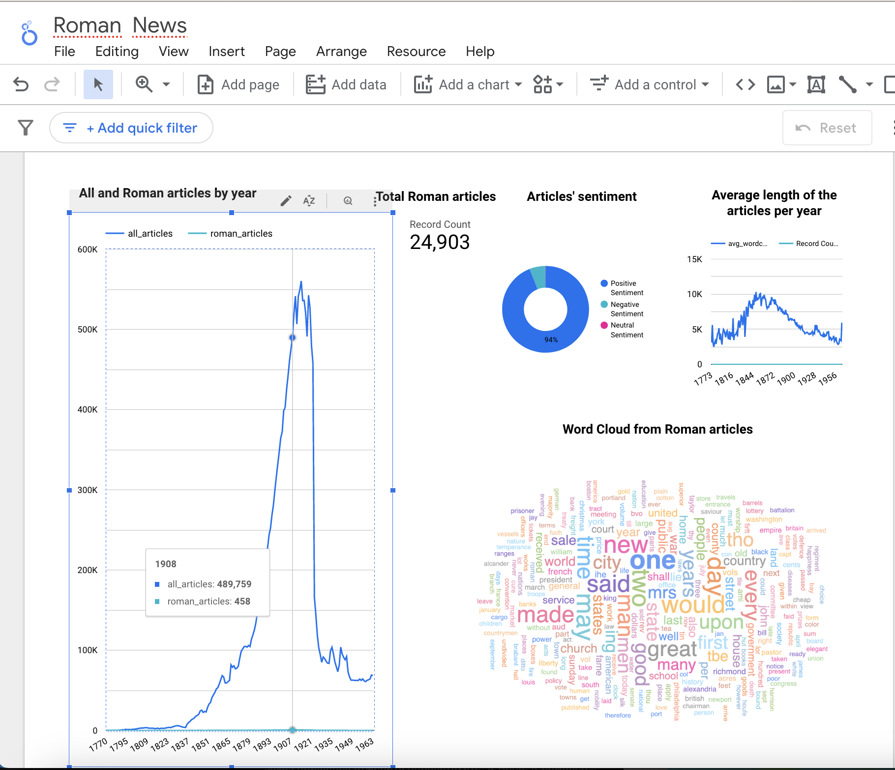

# Roman Empire Zoomcamp
Project for DTC Data Engineering Zoomcamp 2024


The goal of this project is to apply everything we have learned in [the course](https://github.com/DataTalksClub/data-engineering-zoomcamp/tree/main) to build an end-to-end data pipeline. OK. SPQR.

## Problem description

How often do you think about the Roman Empire?

All my schoolmates and me think about the Roman Empire daily, just because we've finished the classical school with all these latin and ancient greek languages and many hours of history and literature, of cause the ancient. And when this meme became popular (wiki says in in mid-September 2023, we'll check), I've understood, that we are not alone and all the world thinks about the Roman Empire too. Even when I did my homework on hadoop mapreduce course, the result of top 5 bigrams from wiki contained "roman_empire". That's nice!

In this project I want to think about the Roman Empire with twitter users, just because it is a huge social network overflowing with data in every conceivable field, updated in real time, easily
accessible and made for short messages (the data is not so big:)

I really want to know timeline of thinking about the Roman Empire and sentiment of messages, to see word cloud of tweets' content and top 5 tweets. 

## Project architecture

Data comes from Twitter. They are extracted using
[snscrape](https://medium.com/@noumanmustafa741/getting-data-from-twitter-using-snscrape-d6f8f4243d8b).

The whole process is orchestrated by the workflow orchestration engine [Mage](https://docs.mage.ai/introduction/overview).

A pipeline stars with scheduler and gets the data, cleans it, saves first it as a parquet file and then moves to a Data Lake (GCP Storage). Another pipeline starts with trigger and 
gets data from the Data Lake to tranfer it to DWH (BigQuery) with some transformations, and the third triggered pipeline makes transformations with dbt.

To create resources in GCP I used [Terraform](https://www.terraform.io/), just because it was in the course as IaC (Infrastructure as code) servise and is really useful.

A dashboard was built with [Google Looker](https://cloud.google.com/looker) from BigQuery data.

This diagram presents the high level architecture of the project.

(Temporary unavailable) 

## Dashboard

This is what my final dashboard looks like.

(Temporary unavailable) 

(Temporary unavailable) You can view my dashboard [here](https://lookerstudio.google.com/reporting/)

## Reproducibility

You will find below **detailed instructions** for replicating this pipeline from scratch to the dashboard.

## Future work

- Try all this with another popular Cloud, that accept my cards:)
- Make incremental model, to append only the latest data from each load.
- Documentation and data quality tests in dbt.
- Try Spark transformations instead of dbt
- Try Streaming process with Kafka and Spark.

## License

MIT License.

## Instructions for reproducibility

You will find below **very detailed instructions** for replicating this pipeline from scratch to the dashboard.

The step-by-step instructions consist of several steps:

- Set Up Your Cloud Environment
  - Step 1: Create a project in Google Cloud Platform (GCP)
  - Step 2: Install Google Cloud CLI
  - Step 3: Configure permissions for GCP services
  - Step 4: Install Terraform
  - Step 5: Create resources in GCP using Terraform
- Set Up Your Virtual Machine
  - Step 6: Create SSH key pairs (optional)
  - Step 7: Create SSH config file (optional)
  - Step 8: Install packages on the Virtual Machine (Docker & Mage)
- Set Up and run pipelines
  - Step 9: Edit configuration file
  - Step 10: Build pipelines with Mage
  - Step 11: Run the pipelines
- Step 12: Create dashboard for data visualization
- Step 13: Stop and delete to avoid costs


The project was developed using a Macbook, but locally there is only Terraform and Google CLI:) Of cause we can create VM Instance with Terraform and G CLI to create our project instance from there and have all the project in the Cloud, but it's seems to be a very stupid idea:) 

### Content of the repository

This repository (<https://github.com/nyan222/roman_empire_zoomcamp>) contains following folders:

- `terraform`: this folder is related to Terraform.
- `mage-empire`: this folder contains Mage project with dbt inside Mage.
- `pics`: this folder contains pictures for this README.

### Step 1: Create a new project in Google Cloud Platform

If you do not have a GCP account, [create one now](https://console.cloud.google.com/freetrial/). This tutorial can be
completed using only the services included in the GCP [free tier](https://cloud.google.com/free/).

Unfortunnaly, your credit card information is needed. And you should register google billing account only from the country, where you get your card, without vpn, and your card could not be virtual. So nice working antifraud algorithm. So simple for some countries:((
GCP states that it will not charge you unless you explicitly end your free-trial period, but be careful. But it was clearly indicated when registering: No autocharge after free trial ends. But you should always be careful:)

Once you’ve created the account, logging into [Google Cloud Platform (GCP) console](https://console.cloud.google.com).

[Create a new project](https://console.cloud.google.com/projectcreate) in the GCP console. Name this new project `roman-empire`. Make note of the **project ID** (mine is `coral-firefly-411510`). For subsequent steps, you will need to replace the `PROJECT_ID` with your own **project ID**.

Go to [Compute Engine API](https://console.cloud.google.com/apis/library/compute.googleapis.com), select your project (mine is `roman-empire`) and click on **ENABLE** button.


This operation may take some minutes.


### Step 2: Install Google Cloud CLI

The [Google Cloud CLI](https://cloud.google.com/sdk/gcloud) (gcloud CLI) is a set of tools to create and manage Google Cloud resources. You can use these tools to perform many common platform tasks from the command line or through scripts and other automation.

Go to [Install the gcloud CLI](https://cloud.google.com/sdk/docs/install), choose your Operating System (OS), and follow
the installation instructions to install gcloud CLI on your local machine.

Confirm that gcloud is installed with `gcloud -v`.

``` txt
gcloud -v
```

You should see something like this:

``` txt
Google Cloud SDK 462.0.1
bq 2.0.101
core 2024.01.31
gcloud-crc32c 1.0.0
gsutil 5.27
```

If there is a problem, add path to your shell manually, my shell is here - ~/.zshrc, with some editor, I'm ok with vim, but you can better edit it with vscode

```bash
# The next line updates PATH for the Google Cloud SDK.
if [ -f '~/Applications/google-cloud-sdk/path.zsh.inc' ]; then . '~/Applications/google-cloud-sdk/path.zsh.inc'; fi

# The next line enables shell command completion for gcloud.
if [ -f '~/Applications/google-cloud-sdk/completion.zsh.inc' ]; then . '~Applications/google-cloud-sdk/completion.zsh.inc'; fi
```

And then run 

```bash
source ~/.zshrc
```

### Step 3: Configure permissions for GCP services (with service account and it's key)

There is nice step-by-step instruction from Google, [how to create service account with console or CLI](https://cloud.google.com/iam/docs/service-accounts-create#iam-service-accounts-create-console)

See also an article [Understanding Service accounts](https://cloud.google.com/iam/docs/understanding-service-accounts)

The course shows, that we have to have these roles:


In console you schould add it by hands, following the instruction, but if you are ok with roles' names, you can use CLI

From your local machine, run the following command.

``` bash
gcloud auth login
```

**Google Cloud SDK** will ask you for permission to access your Google Account. Click on **Allow** button.

Still from your local machine, run the following commands. Remember that you need to replace the `PROJECT_ID` with your own (mine is `coral-firefly-411510`).

``` bash
PROJECT_ID="coral-firefly-411510"
gcloud config set project $PROJECT_ID
gcloud components update
gcloud iam service-accounts create terraform-runner --display-name "terraform-runner"
```

In the Google Cloud console, on the left menu, go to the **IAM & Admin** and select **Service Accounts**. A service account whose name begins with `terraform-runner@…​` should be created (mine is `terraform-runner@coral-firefly-411510.iam.gserviceaccount.com`).

Next, we have to define the roles.

From your local machine, run the following commands.

Remember that you need to replace the `PROJECT_ID` with your own (mine is `coral-firefly-411510`).

``` bash
PROJECT_ID="coral-firefly-411510"
gcloud projects add-iam-policy-binding $PROJECT_ID \
--member="serviceAccount:terraform-iam@$PROJECT_ID.iam.gserviceaccount.com" \
--role="roles/viewer"
gcloud projects add-iam-policy-binding $PROJECT_ID \
--member="serviceAccount:terraform-iam@$PROJECT_ID.iam.gserviceaccount.com" \
--role="roles/storage.admin"
gcloud projects add-iam-policy-binding $PROJECT_ID \
--member="serviceAccount:terraform-iam@$PROJECT_ID.iam.gserviceaccount.com" \
--role="roles/storage.objectAdmin"
gcloud projects add-iam-policy-binding $PROJECT_ID \
--member="serviceAccount:terraform-iam@$PROJECT_ID.iam.gserviceaccount.com" \
--role="roles/bigquery.admin"
```

And so on, if you find all 13 roles. I did with console:)

Now, we have to download a JSON key file representing the credentials.

From your local machine, run the following commands.

Remember that you need to replace the `PROJECT_ID` with your own (mine is `coral-firefly-411510`).

``` bash
PROJECT_ID="coral-firefly-411510"
mkdir ~/.config/gcloud
gcloud iam service-accounts keys create ~/.config/gcloud/cfk.json \
--iam-account=terraform-runner@$PROJECT_ID.iam.gserviceaccount.com
```
(cfk means coral-firefly-key:)

You also can get the key from [console](https://cloud.google.com/iam/docs/keys-create-delete)

Please be careful with git!!! Use *.json in every .gitignore you have, the key shoud not get to repository. Everyone who get it can use your cloud resources.

Once the key has been downloaded, set your environment variable `GOOGLE_APPLICATION_CREDENTIALS` to the path of your JSON.

``` bash
export GOOGLE_APPLICATION_CREDENTIALS=~/.config/gcloud/cfk.json
```
From your local machine, run the following command to login again and answer 'Y' to continue.

``` bash
gcloud auth application-default login
```

**Google Auth Library** will ask you for permission to access your Google Account. Click on **Allow** button.

Congratulations! You are now authenticated with the gcloud CLI!

### Step 4: Install Terraform

[Terraform](https://developer.hashicorp.com/terraform/intro) is an infrastructure as code tool that lets you build,
change, and version cloud and on-prem resources safely and efficiently.

Go to [Install Terraform](https://developer.hashicorp.com/terraform/downloads?product_intent=terraform), choose version for your Operating System (OS), and follow the installation instructions to install Terraform on your local machine.

If you had difficulties with creating billing account for GCP, you could have problems with terraform site and then with terraform init, please use vpn.

Confirm that Terraform is installed with `terraform -version`.

``` txt
terraform -version
```

You should see something like this.

``` txt
Terraform v1.7.0
on darwin_arm64
```

### Step 5: Create resources in GCP using Terraform

We will now create the resources in our google cloud project. Instead of creating these resources manually, it is easier to create them programmatically.

With Terraform installed, you are ready to create infrastructure.

Clone this repository somewhere to your local machine.

``` bash
git clone https://github.com/nyan222/roman_empire_zoomcamp.git
```
In the week 1 of the Zoomcamp we did the same, but the problem is that we have to [create multiple BQ datasets](https://stackoverflow.com/questions/74586936/how-to-create-a-multiple-datasets-and-set-acess-in-bigquery) for dbt dev and prod and with 'raw' data

This repository contains four files related to Terraform:

- `roman_empire_zoomcamp/terraform/main.tf` contains the main set of configuration for our project.
- `roman_empire_zoomcamp/terraform/variables.tf` contain the variable definitions for our project.
- `roman_empire_zoomcamp/terraform/resource/datasets.json` contains the json with datasets' descriptions.
- `roman_empire_zoomcamp/terraform/locals.tf` contains the json parser.

And we could not see resource/datasets.json because of security in .gitignore, here it is, we should create it again:
```json
{
    "datasets": {
      "roman_raw": {
        "dataset_id": "roman_raw"
      },
      "roman_dbt_dev": {
        "dataset_id": "roman_dbt_dev"
      },
      "roman_dbt_prod": {
        "dataset_id": "roman_dbt_prod"
      }
    }
  }
```

In `roman_empire_zoomcamp/terraform/variables.tf` file, you must replace the values of certain parameters with your own:

- Variable `project` for your `PROJECT_ID` (mine is `coral-firefly-411510`).
- Variable `region` for a region near you (mine is `us-west1`). Choose your location
  [here](https://cloud.google.com/about/locations), ideally offering low carbon intensity,
- Variable `zone`, used for the virtual machine (mine is `us-west1-b`). See [Available regions and
  zones](https://cloud.google.com/compute/docs/regions-zones#available).

Save and close the `roman_empire_zoomcamp/terraform/variables.tf` file.

When you create a new configuration with Terraform, you need to initialize the directory.

From your local machine, run [terraform init](https://www.terraform.io/docs/commands/init.html) to initialize the working directory.

``` bash
cd
cd roman_empire_zoomcamp/terraform/
terraform init
```

You should see this.

``` bash
Initializing the backend...

Successfully configured the backend "local"! Terraform will automatically
use this backend unless the backend configuration changes.

Initializing provider plugins...
- Finding latest version of hashicorp/google...
- Installing hashicorp/google v5.16.0...
- Installed hashicorp/google v5.16.0 (signed by HashiCorp)

Terraform has created a lock file .terraform.lock.hcl to record the provider
selections it made above. Include this file in your version control repository
so that Terraform can guarantee to make the same selections by default when
you run "terraform init" in the future.

Terraform has been successfully initialized!

You may now begin working with Terraform. Try running "terraform plan" to see
any changes that are required for your infrastructure. All Terraform commands
should now work.

If you ever set or change modules or backend configuration for Terraform,
rerun this command to reinitialize your working directory. If you forget, other
commands will detect it and remind you to do so if necessary.
```

Remember about vpn if you face difficulties.

Next, run [terraform validate](https://www.terraform.io/docs/commands/validate.html) to validate Terraform configuration
files on the local machine.

``` bash
terraform validate
```

You should see this.

```bash
Success! The configuration is valid.
```

Next, run [terraform plan](https://developer.hashicorp.com/terraform/cli/commands/plan) to validate that Terraform configuration files from a remote services perspective.

``` bash
terraform plan
```

Terraform will indicate what infrastructure changes it plans to make.

You should see this.

```bash
Terraform used the selected providers to generate the following execution plan. Resource actions are indicated with the following
symbols:
  + create

Terraform will perform the following actions:

  # google_bigquery_dataset.datasets["roman_dbt_dev"] will be created
  + resource "google_bigquery_dataset" "datasets" {
      + creation_time              = (known after apply)
      + dataset_id                 = "roman_dbt_dev"
      + default_collation          = (known after apply)
      + delete_contents_on_destroy = true
      + effective_labels           = (known after apply)
      + etag                       = (known after apply)
      + id                         = (known after apply)
      + is_case_insensitive        = (known after apply)
      + last_modified_time         = (known after apply)
      + location                   = "us-west1"
      + max_time_travel_hours      = (known after apply)
      + project                    = "coral-firefly-411510"
      + self_link                  = (known after apply)
      + storage_billing_model      = (known after apply)
      + terraform_labels           = (known after apply)
    }

  # google_bigquery_dataset.datasets["roman_dbt_prod"] will be created
  + resource "google_bigquery_dataset" "datasets" {
      + creation_time              = (known after apply)
      + dataset_id                 = "roman_dbt_prod"
      + default_collation          = (known after apply)
      + delete_contents_on_destroy = true
      + effective_labels           = (known after apply)
      + etag                       = (known after apply)
      + id                         = (known after apply)
      + is_case_insensitive        = (known after apply)
      + last_modified_time         = (known after apply)
      + location                   = "us-west1"
      + max_time_travel_hours      = (known after apply)
      + project                    = "coral-firefly-411510"
      + self_link                  = (known after apply)
      + storage_billing_model      = (known after apply)
      + terraform_labels           = (known after apply)
    }

  # google_bigquery_dataset.datasets["roman_raw"] will be created
  + resource "google_bigquery_dataset" "datasets" {
      + creation_time              = (known after apply)
      + dataset_id                 = "roman_raw"
      + default_collation          = (known after apply)
      + delete_contents_on_destroy = true
      + effective_labels           = (known after apply)
      + etag                       = (known after apply)
      + id                         = (known after apply)
      + is_case_insensitive        = (known after apply)
      + last_modified_time         = (known after apply)
      + location                   = "us-west1"
      + max_time_travel_hours      = (known after apply)
      + project                    = "coral-firefly-411510"
      + self_link                  = (known after apply)
      + storage_billing_model      = (known after apply)
      + terraform_labels           = (known after apply)
    }

  # google_compute_instance.my-instance will be created
  + resource "google_compute_instance" "my-instance" {
      + allow_stopping_for_update = true
      + can_ip_forward            = false
      + cpu_platform              = (known after apply)
      + current_status            = (known after apply)
      + deletion_protection       = false
      + effective_labels          = (known after apply)
      + guest_accelerator         = (known after apply)
      + id                        = (known after apply)
      + instance_id               = (known after apply)
      + label_fingerprint         = (known after apply)
      + machine_type              = "e2-standard-4"
      + metadata_fingerprint      = (known after apply)
      + min_cpu_platform          = (known after apply)
      + name                      = "roman-empire"
      + project                   = "coral-firefly-411510"
      + self_link                 = (known after apply)
      + tags_fingerprint          = (known after apply)
      + terraform_labels          = (known after apply)
      + zone                      = "us-west1-b"

      + boot_disk {
          + auto_delete                = true
          + device_name                = (known after apply)
          + disk_encryption_key_sha256 = (known after apply)
          + kms_key_self_link          = (known after apply)
          + mode                       = "READ_WRITE"
          + source                     = (known after apply)

          + initialize_params {
              + image                  = "ubuntu-os-cloud/ubuntu-2004-lts"
              + labels                 = (known after apply)
              + provisioned_iops       = (known after apply)
              + provisioned_throughput = (known after apply)
              + size                   = 100
              + type                   = (known after apply)
            }
        }

      + network_interface {
          + internal_ipv6_prefix_length = (known after apply)
          + ipv6_access_type            = (known after apply)
          + ipv6_address                = (known after apply)
          + name                        = (known after apply)
          + network                     = "default"
          + network_ip                  = (known after apply)
          + stack_type                  = (known after apply)
          + subnetwork                  = "default"
          + subnetwork_project          = (known after apply)

          + access_config {
              + nat_ip       = (known after apply)
              + network_tier = (known after apply)
            }
        }
    }

  # google_storage_bucket.data-lake-bucket will be created
  + resource "google_storage_bucket" "data-lake-bucket" {
      + effective_labels            = (known after apply)
      + force_destroy               = true
      + id                          = (known after apply)
      + location                    = "US-WEST1"
      + name                        = "roman_empire_zoomcamp"
      + project                     = (known after apply)
      + public_access_prevention    = (known after apply)
      + rpo                         = (known after apply)
      + self_link                   = (known after apply)
      + storage_class               = "STANDARD"
      + terraform_labels            = (known after apply)
      + uniform_bucket_level_access = true
      + url                         = (known after apply)

      + lifecycle_rule {
          + action {
              + type = "Delete"
            }
          + condition {
              + age                   = 22
              + matches_prefix        = []
              + matches_storage_class = []
              + matches_suffix        = []
              + with_state            = (known after apply)
            }
        }

      + versioning {
          + enabled = true
        }
    }

Plan: 5 to add, 0 to change, 0 to destroy.
```

Nice! We see 3 BQ datasets:)

Finally, run [terraform apply](https://developer.hashicorp.com/terraform/cli/commands/apply) to execute the actions proposed in a Terraform plan and apply the configuration concretely on your project in Google Cloud.

``` bash
terraform apply
```

Respond to the confirmation prompt with a `yes`.

The last two commands may take some times to run.

After that, you should see somethig like this in your terminal.

``` bash
google_bigquery_dataset.datasets["roman_dbt_dev"]: Creating...
google_bigquery_dataset.datasets["roman_raw"]: Creating...
google_bigquery_dataset.datasets["roman_dbt_prod"]: Creating...
google_storage_bucket.data-lake-bucket: Creating...
google_compute_instance.my-instance: Creating...
google_bigquery_dataset.datasets["roman_dbt_prod"]: Creation complete after 2s [id=projects/coral-firefly-411510/datasets/roman_dbt_prod]
google_bigquery_dataset.datasets["roman_raw"]: Creation complete after 2s [id=projects/coral-firefly-411510/datasets/roman_raw]
google_bigquery_dataset.datasets["roman_dbt_dev"]: Creation complete after 2s [id=projects/coral-firefly-411510/datasets/roman_dbt_dev]
google_storage_bucket.data-lake-bucket: Creation complete after 3s [id=roman_empire_zoomcamp]
google_compute_instance.my-instance: Still creating... [10s elapsed]
google_compute_instance.my-instance: Creation complete after 18s [id=projects/coral-firefly-411510/zones/us-west1-b/instances/roman-empire]

Apply complete! Resources: 5 added, 0 changed, 0 destroyed.
```

In the Google Cloud console, on the left menu, go to the **Compute Engine** and **VM instances**. You shold see a new Virtual Machine (VM) instance (mine is `roman-empire`) on Ubuntu 20.04.6 LTS with 4vCPUs, 16 GB of memory and 100 GB of disk space.


Take note of your `EXTERNAL_IP`. We will need it later.

In the Google Cloud console, on the left menu, go to the **Cloud Storage** and **Buckets**. You shold see a new a new Compute Engine Bucket (mine is `twitter_data_lake_dtc-de-382923`).


In the Google Cloud console, on the left menu, go to the **Big Query**. You shold see a new a new BigQuery Datasets (mine is `dtc-de-382923.twitter`).


If these three services are created, everything is fine and we can move on to the next step.

### Step 6: Create SSH key pairs (optional)

Note!: In any case it would be nice to see again the lecture [DE Zoomcamp 1.4.1 - Setting up the Environment on Google Cloud (Cloud VM + SSH access)](https://www.youtube.com/watch?v=ae-CV2KfoN0).

In order to avoid typing the password each time to connect to the VM from the local machine, you can create an SSH key
pairs on the local machine.

Follow the instructions below according to your Operating System (OS).

#### Linux and macOS

For Linux and macOS, run the following command. Replace the `USERNAME` on your computer. Replace also `KEY_FILENAME`
with a more common filename like `my-ssh-key`.

``` bash
ssh-keygen -t rsa -f ~/.ssh/KEY_FILENAME -C USERNAME -b 2048
```

`ssh-keygen` saves your private key file to `~/.ssh/KEY_FILENAME` and your public key file to `~/.ssh/KEY_FILENAME.pub`.

#### Windows 10 or later

For Windows 10 or later, see these
[instructions](https://cloud.google.com/compute/docs/connect/create-ssh-keys#windows-10-or-later).

`ssh-keygen` saves your private key file to `C:\Users\WINDOWS_USER\.ssh\KEY_FILENAME` and your public key file to
`C:\Users\WINDOWS_USER\.ssh\KEY_FILENAME.pub`.

#### Add SSH keys to VM

Next, copy and upload the public key `KEY_FILENAME.pub` to GCP.

In the Google Cloud console, select **Compute Engine** from the left menu, then **Metadata** (list down-down-down), select **SSH KEYS** tab,
click on **ADD SSH KEY** button.

Paste the public key in the field, and click on **SAVE** button.


Here, a trick to copy the contents of your public `KEY_FILENAME.pub` file. Just run the following command.

``` bash
cat ~/.ssh/KEY_FILENAME.pub | pbcopy
```

### Step 7: Create SSH config file (optional)

Next, create a file `~/.ssh/config` on your local machine.

``` bash
touch ~/.ssh/config
```

Edit the file et add this content.

``` bash
Host roman-empire
    HostName EXTERNAL_IP
    User USERNAME
    IdentityFile ~/.ssh/KEY_FILENAME
```

Replace the following:

- `EXTERNAL_IP`: the external IP of the VM instance. It always changes, when you stop and start your VM, so you should every time edit config, but it's ok and don't forget
- `USERNAME`: your username on the VM, either the same username used to generate the SSH key.
- `~/.ssh/KEY_FILENAME`: the path of the private SSH key. Note that it has to be absolute path for Windows.

To access your virtual machine, just run this command:

``` bash
ssh roman-empire
```

Respond to the confirmation prompt with a `yes`.

Nicevi! You should see this something like this.

``` txt
The authenticity of host 'XXX.XXX.XXX.XXX (XXX.XXX.XXX.XXX)' can't be established.
ED25519 key fingerprint is SHA256:Cb5xffksisnldfglkw98sdidf9d8sg09ad8g+FB71c.
This key is not known by any other names
Are you sure you want to continue connecting (yes/no/[fingerprint])? yes
Warning: Permanently added 'XXX.XXX.XXX.XXX' (EDXXXXX) to the list of known hosts.
Welcome to Ubuntu 20.04.6 LTS (GNU/Linux 5.15.0-1051-gcp x86_64)

 * Documentation:  https://help.ubuntu.com
 * Management:     https://landscape.canonical.com
 * Support:        https://ubuntu.com/pro

  System information as of Sat Feb 17 11:40:32 UTC 2024

  System load:  0.0               Processes:             118
  Usage of /:   2.0% of 96.73GB   Users logged in:       0
  Memory usage: 1%                IPv4 address for ens4: 10.138.0.3
  Swap usage:   0%

Expanded Security Maintenance for Applications is not enabled.

0 updates can be applied immediately.

Enable ESM Apps to receive additional future security updates.
See https://ubuntu.com/esm or run: sudo pro status


The list of available updates is more than a week old.
To check for new updates run: sudo apt update


The programs included with the Ubuntu system are free software;
the exact distribution terms for each program are described in the
individual files in /usr/share/doc/*/copyright.

Ubuntu comes with ABSOLUTELY NO WARRANTY, to the extent permitted by
applicable law.

g***k@roman-empire:~$
```

Otherwise, without `~/.ssh/config` file, you need to run this command:

``` bash
ssh -i ~/.ssh/gcp USERNAME@EXTERNAL_IP
```

Where `USERNAME` is your username on the VM and `EXTERNAL_IP` is the external IP of the VM.


### Step 8: Install packages on the Virtual Machine

First of all we have to install Docker!

Remember that you can run the `ssh roman-empire` command from your local machine to easily access your remote instance.

``` bash
g***k@roman-empire:~$ sudo apt-get update
g***k@man-empirero:~$ sudo apt-get install docker.io
```

And we need also docker compose, we can choose best version [here](https://github.com/docker/compose)


```bash
mkdir bin
cd bin
wget https://github.com/docker/compose/releases/download/v2.15.0/docker-compose-linux-x86_64 -O docker-compose
ls -la
# docker-compose
chmod +x docker-compose
./docker-compose version
# Docker Compose version v2.15.0
cd
vim .bashrc
```

Then we should add this in .bashrc file (I for Insert, Escape to return, :wq - save and exit)
```bash
export PATH="${HOME}/bin:${PATH}"
```

And then we return to cli:

```bash
source .bashrc
which docker-compose
# /home/g***k/bin/docker-compose
docker-compose version
# Docker Compose version v2.15.0
```

So now we need our workflow orchestrator Mage.

Everything for quick start can be found here - so nice and short and clear [videos](https://github.com/DataTalksClub/data-engineering-zoomcamp/tree/main/02-workflow-orchestration)

But I've copied my DEZoomcamp Mage Project with some additions and examples just to reuse when developing

We shoul clone [the repository of Roman Empire Project](https://github.com/nyan222/roman_empire_zoomcamp.git) to VM
```bash
cd
git clone https://github.com/nyan222/roman_empire_zoomcamp.git

```

For some debugging things we can  install Anaconda for Linux, but it's optional.


Best for you version to install your can find [here](https://www.anaconda.com/download#downloads)

``` bash
cd
wget https://repo.anaconda.com/archive/Anaconda3-2023.09-0-MacOSX-arm64.sh
bash Anaconda3-2023.09-0-MacOSX-arm64.sh
rm Anaconda3-2023.09-0-MacOSX-arm64.sh
source ~/anaconda3/bin/activate
source ~/.bashrc
```

Still on your VM instance, run the following commands to create a conda environment and install necessary packages.

``` bash
cd
git clone https://github.com/boisalai/twitter-dashboard.git
conda create -n myenv python=3.9
conda activate myenv
conda install pip
conda update -n base -c defaults conda
pip install -r ~/twitter-dashboard/requirements.txt
pip install -U pip setuptools wheel
```

After that, you have a conda environment `myenv` with all required libraries installed.

### Step 13: Stop and delete to avoid costs

To avoid incurring unnecessary charges to your GCP account, destroy all remote objects managed by a our Terraform
configuration

On your local machine, run this command.

``` bash
terraform destroy
```

You can also manually delete your Virtual Environment, Bucket and BigQuery ressource and perhaps your Google Cloud
project.

